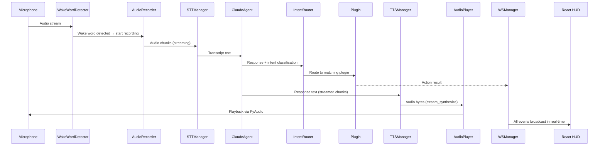

# JARVIS — Architecture

## Folder Structure

```
jarvis/
├── backend/                    # Python FastAPI backend (all server logic)
│   ├── main.py                 # Entry point — runs uvicorn on port 8765
│   ├── api/                    # HTTP + WebSocket transport layer
│   │   ├── fastapi_app.py      # FastAPI app factory, CORS, lifespan
│   │   ├── schemas.py          # Pydantic request/response models
│   │   ├── settings_handler.py # Settings CRUD handler
│   │   └── routers/
│   │       ├── system.py       # /api/v1/health, /api/v1/settings
│   │       └── websocket.py    # /ws WebSocket endpoint
│   │
│   ├── core/                   # Cross-cutting infrastructure
│   │   ├── config.py           # JarvisConfig Pydantic model + YAML loader
│   │   ├── default.yaml        # Default configuration values
│   │   ├── orchestrator.py     # JarvisBackend — central coordinator (singleton)
│   │   ├── event_bus.py        # Async pub/sub (EventBus + JarvisEvents)
│   │   ├── logger.py           # Loguru setup (console + rotating file)
│   │   ├── error_handler.py    # Custom exceptions + global handler
│   │   ├── health_check.py     # Component health probes
│   │   └── retry.py            # Exponential backoff decorator
│   │
│   ├── services/               # Business logic services
│   │   ├── brain/
│   │   │   └── agent.py        # ClaudeAgent — multi-provider LLM client
│   │   └── voice/
│   │       ├── pipeline.py     # VoicePipeline — wake→STT→LLM→TTS flow
│   │       ├── state_machine.py # VoiceState enum + transition validator
│   │       ├── tts.py          # TTSManager — engine selector + streaming
│   │       ├── tts_edge.py     # Edge TTS engine
│   │       ├── tts_elevenlabs.py # ElevenLabs engine
│   │       ├── tts_piper.py    # Piper local TTS
│   │       ├── tts_kokoro.py   # Kokoro TTS
│   │       ├── tts_kitten.py   # Kitten TTS
│   │       ├── tts_local.py    # Generic local TTS
│   │       ├── stt_manager.py  # STT engine selector
│   │       ├── stt.py          # Base STT interface
│   │       ├── stt_moonshine.py # Moonshine STT engine
│   │       ├── stt_vosk.py     # Vosk STT engine
│   │       └── model_manager.py # ML model download + caching
│   │
│   ├── infrastructure/         # External system adapters
│   │   ├── audio/
│   │   │   ├── audio_player.py # PyAudio playback (play + play_stream)
│   │   │   ├── audio_queue.py  # Audio chunk queue
│   │   │   ├── listener.py     # WakeWordDetector
│   │   │   └── recorder.py     # AudioRecorder (mic capture + VAD)
│   │   ├── database/
│   │   │   ├── db.py           # aiosqlite connection factory
│   │   │   └── migrations/     # Schema migration scripts
│   │   └── websocket/
│   │       └── manager.py      # WSManager — connection pool + broadcast
│   │
│   ├── brain/                  # AI reasoning layer
│   │   ├── intent.py           # IntentRouter — maps intents to plugins
│   │   ├── prompt_templates.py # System prompt builder
│   │   └── memory/
│   │       ├── short_term.py   # Deque-based conversation window
│   │       ├── long_term.py    # SQLite + embedding retrieval
│   │       ├── context_builder.py # Merges short + long term for prompts
│   │       └── summarizer.py   # Conversation summarization
│   │
│   ├── auth/                   # Voice authentication (experimental)
│   │   ├── access_control.py   # Intent-level permission gating
│   │   ├── speaker_verify.py   # Speaker embedding verification
│   │   ├── enrollment.py       # Voice enrollment flow
│   │   ├── liveness.py         # Anti-spoofing challenge/response
│   │   └── embeddings.py       # Voice embedding extraction
│   │
│   ├── plugins/                # Capability plugins (all extend JarvisPlugin)
│   │   ├── base.py             # JarvisPlugin ABC + PluginResult
│   │   ├── plugin_manager.py   # Discovery + dispatch
│   │   ├── app_launcher.py     # Launch desktop applications
│   │   ├── web_search.py       # Brave Search integration
│   │   ├── file_manager.py     # File system operations
│   │   ├── system_control.py   # Volume, brightness, shutdown
│   │   ├── screen_reader.py    # Screen content extraction
│   │   └── scheduler.py        # Reminders and timers
│   │
│   ├── os_bridge/              # Platform abstraction
│   │   ├── platform_detect.py  # OS detection
│   │   ├── linux.py            # Linux-specific implementations
│   │   ├── macos.py            # macOS-specific implementations
│   │   └── windows.py          # Windows-specific implementations
│   │
│   └── tests/                  # pytest test suite
│       ├── conftest.py         # Shared fixtures
│       ├── test_auth.py
│       ├── test_fastapi_transport.py
│       ├── test_intent.py
│       ├── test_memory.py
│       ├── test_plugins.py
│       ├── test_stt.py
│       ├── test_tts.py
│       └── ... (16 test files)
│
├── frontend/                   # Electron + React desktop app
│   ├── electron/
│   │   ├── main.js             # Electron main process
│   │   └── preload.js          # Context bridge for IPC
│   └── src/
│       ├── main.jsx            # React entry point
│       ├── App.tsx             # Root component + routing
│       ├── components/         # HUD, Waveform, StatusRing, etc.
│       ├── hooks/              # useWebSocket, useVoiceState
│       ├── pages/              # HomePage, SettingsPage
│       ├── store/              # Zustand stores (voice, settings)
│       ├── layouts/            # Page layout wrappers
│       ├── lib/                # Shared utilities
│       └── __tests__/          # Vitest test suites
│
├── shared/                     # IPC protocol contract
│   ├── ipc_protocol.json       # Message schema (type + payload + request_id)
│   └── events.py               # Python event name constants
│
├── scripts/                    # Developer tooling
│   ├── setup.sh                # One-command environment setup
│   ├── dev.sh                  # Start dev (backend + frontend)
│   └── download_models.py      # Download STT/TTS models
│
├── agent/                      # AI agent knowledge base (this directory)
├── .agent/                     # AI agent runtime state (gitignored)
├── pyproject.toml              # Ruff, mypy, bandit configuration
├── .pre-commit-config.yaml     # Pre-commit hooks
├── .env.example                # API key template
└── README.md
```

## Data Flow

### Voice Pipeline (Primary Path)



### State Machine Transitions

```
IDLE → WAKE_DETECTED → LISTENING → TRANSCRIBING → VERIFYING → THINKING → SPEAKING → IDLE
                                                     ↑ (optional, auth enabled)
```

## Key Modules

| Module | Responsibility |
|--------|---------------|
| `core/orchestrator.py` | Singleton coordinator — initializes all subsystems, owns lifecycle |
| `services/voice/pipeline.py` | Voice loop + text command processing (`_voice_loop`, `_run_turn`) |
| `services/brain/agent.py` | Multi-provider LLM client with streaming + fallback |
| `core/event_bus.py` | Decoupled async pub/sub between modules |
| `core/config.py` | Layered config: YAML → env vars → Pydantic validation |
| `infrastructure/websocket/manager.py` | WebSocket connection pool with broadcast |
| `brain/intent.py` | Maps LLM intent labels → plugin `execute()` calls |
| `plugins/plugin_manager.py` | Auto-discovers and dispatches to capability plugins |

## Communication Patterns

- **Internal**: Modules communicate via `EventBus` (async pub/sub) — not direct imports
- **Frontend ↔ Backend**: WebSocket messages follow `shared/ipc_protocol.json` schema
- **Config**: Layered merge: `default.yaml` → `user_config.yaml` → `.env` → runtime overrides
- **Error propagation**: Custom `JarvisError` hierarchy → `ErrorPayload` → WebSocket broadcast
